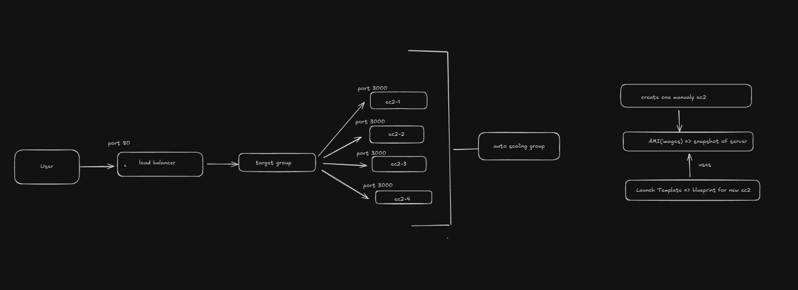

# AWS Auto Scaling 

## What is AWS Auto Scaling?
AWS Auto Scaling is a service that **automatically increases or decreases EC2 instances** based on traffic or load.

High traffic → more servers  
Low traffic → fewer servers  

This helps keep the application **fast, available, and cost-efficient**.

---

## Why AWS Auto Scaling is Needed
- Prevents server crash during high traffic
- Saves cost during low traffic
- Removes manual server management
- Improves availability and reliability

---

## Core Components of AWS Auto Scaling

### EC2 Instance
A virtual server where the application runs (Node.js, backend, APIs, etc.).

---

### AMI (Amazon Machine Image)
A saved image of a configured EC2 instance.

Includes:
- Operating system
- Installed software (Node.js, PM2, app code)
- System configuration

Auto Scaling uses this AMI to launch new EC2 instances.

---

### Launch Template
A blueprint that defines how new EC2 instances are created.

Contains:
- AMI
- Instance type (t2.micro, t3.small, etc.)
- Security group
- Key pair
- User data script (bash script that runs on EC2 startup)

---

### Target Group
A **Target Group is a logical group of EC2 instances** where the Load Balancer forwards traffic.

Key points:
- Load Balancer sends traffic **only to Target Groups**
- Auto Scaling Group automatically **registers and deregisters EC2 instances** in the Target Group
- Target Group performs **health checks** on EC2 instances

Example configuration:
- Protocol: HTTP
- Port: 3000
- Health check path: `/health`

Flow:
User → Load Balancer → Target Group → EC2 instances

---

### Auto Scaling Group (ASG)
Controls how many EC2 instances should run.

Important parameters:
- Minimum instances
- Desired instances
- Maximum instances

Example:
Min = 1  
Desired = 2  
Max = 5  

ASG:
- Launches new EC2s using Launch Template
- Registers EC2s into Target Group
- Replaces unhealthy EC2s automatically

---

### Scaling Policies
Rules that define **when to scale up or down**.

Example:
- CPU usage > 70% → add EC2
- CPU usage < 30% → remove EC2

---

### Load Balancer (Application Load Balancer)
Distributes incoming traffic evenly across EC2 instances using a Target Group.

Request flow:
User → Load Balancer → Target Group → EC2 instances

Without a load balancer, traffic will hit only one server.

---

## How AWS Auto Scaling Works
1. Users send requests
2. Load Balancer receives traffic
3. Load Balancer forwards traffic to Target Group
4. Target Group routes traffic to healthy EC2 instances
5. Auto Scaling monitors metrics (CPU, health checks)
6. New EC2 instances are launched or terminated automatically

---

## Step-by-Step Setup (Correct Order)

### Step 1: Create EC2 and Deploy Application
- Install Node.js
- Start app using PM2
- Ensure app runs correctly

---

### Step 2: Create AMI
Go to EC2 → Actions → Image → Create Image  
This saves the current EC2 state.

---

### Step 3: Create Launch Template
- Select created AMI
- Choose instance type
- Add security group
- Add key pair
- Add user data script (if needed)

---

### Step 4: Create Target Group
- Choose target type: Instance
- Protocol: HTTP
- Port: 3000
- Configure health check path (example: `/health`)

This Target Group will be used by the Load Balancer and Auto Scaling Group.

---

### Step 5: Create Auto Scaling Group
- Select Launch Template
- Attach Target Group
- During this step:
  - Create or attach Application Load Balancer
- Set:
  - Min = 1
  - Desired = 1
  - Max = 3

---

### Step 6: Add Scaling Policy
- Choose target tracking
- Set target CPU utilization to 50%

AWS will handle scaling automatically.

---

## Architecture Diagram

---

## Common Mistakes to Avoid
- Not using a Target Group
- Health check path not implemented
- Application not starting automatically on boot
- Incorrect security group rules
- Wrong port mapping between ALB and EC2

---

## When to Use AWS Auto Scaling
Use it for:
- Production applications
- High traffic websites
- Backend APIs

Avoid it for:
- Very small demo projects
- Local testing environments

---

## Benefits of AWS Auto Scaling
- High availability
- Automatic scaling
- Cost optimization
- Fault tolerance

---

## Summary
AWS Auto Scaling automatically adjusts server capacity based on traffic.  
Target Groups connect Load Balancers with EC2 instances, while Auto Scaling Groups manage EC2 count and health.

Set it once and let AWS manage scaling automatically.
