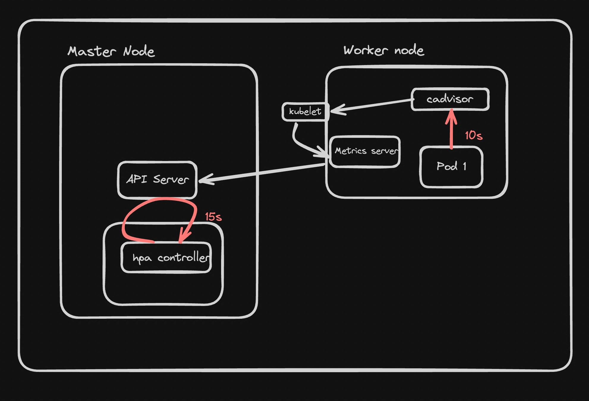

# 🌟 Horizontal Pod Autoscaler (HPA) 

---

# ✅ What is HPA?

HPA (Horizontal Pod Autoscaler) automatically:
- increases pods (scale up)
- decreases pods (scale down)

Based on:
- CPU usage
- Memory
- Custom metrics

👉 If load increases → pods increase  
👉 If load decreases → pods decrease  

---

# ✅ Why we need HPA?

Without HPA:
- fixed pods → app may crash ❌
- waste resources ❌

With HPA:
- auto scaling → better performance ✅
- cost saving ✅

---

# ✅ What is Horizontal Scaling?

- Add more pods (same app copies)
- NOT increase machine CPU/RAM

Example:
1 pod → 3 pods → 5 pods

---

# ✅ Types of Scaling

1. Horizontal Scaling → add/remove pods  
2. Vertical Scaling → increase CPU/RAM  

---

# ✅ Architecture (Flow)

1. Pod runs app  
2. kubelet monitors pod  
3. cAdvisor collects CPU/memory  
4. Metrics Server stores metrics  
5. API Server provides data  
6. HPA Controller decides scaling  

---

# ✅ Components

### kubelet
- Runs on node
- manages pods

### cAdvisor
- Collects CPU/memory
- inside kubelet
- no install needed

### Metrics Server
- collects metrics
- required for HPA

### API Server
- central communication

### HPA Controller
- decides scaling
- runs every 15 sec

---

# ✅ How HPA Works

1. Traffic increases  
2. CPU usage increases  
3. cAdvisor collects data  
4. Metrics Server stores  
5. HPA checks every 15 sec  
6. Compare with target  
7. If high → scale up  
8. If low → scale down  

---

# ✅ Formula

New Pods =
(total CPU usage) / (target CPU)

Example:
(70 + 80) / 50 = 3 pods

---

# ✅ Metrics Types

- CPU (most used)
- Memory
- Custom metrics

---

# ✅ Resource Requests & Limits

Requests:
- minimum CPU reserved

Limits:
- maximum CPU allowed

Example:
requests: 100m  
limits: 1000m  

---

# ✅ Scaling Rules

- ANY metric > target → scale up  
- ALL metrics < target → scale down  

---

# ✅ Control Loop

- runs every 15 seconds  
- not continuous  

---

# ✅ Metrics Flow Timing

- cAdvisor → ~10 sec  
- HPA → ~15 sec  

---

# ✅ Metrics Server

- lightweight tool  
- required for HPA  
- used by kubectl top  

---

# ✅ Cluster Autoscaler

- HPA → scales pods  
- Cluster Autoscaler → scales nodes  

---

# ✅ Setup Steps

## Step 1: Start cluster
minikube start

---

## Step 2: Install Metrics Server
kubectl apply -f https://github.com/kubernetes-sigs/metrics-server/releases/latest/download/components.yaml

---

## Step 3: Verify
kubectl get pods -n kube-system  
kubectl top nodes  
kubectl top pods  

---

## Step 4: Create Deployment

apiVersion: apps/v1
kind: Deployment
metadata:
  name: cpu-deployment
spec:
  replicas: 2
  selector:
    matchLabels:
      app: cpu-app
  template:
    metadata:
      labels:
        app: cpu-app
    spec:
      containers:
      - name: cpu-app
        image: 100xdevs/week-28:latest
        ports:
        - containerPort: 3000
        resources:
          requests:
            cpu: "100m"
          limits:
            cpu: "1000m"

Apply:
kubectl apply -f deployment.yaml

---

## Step 5: Create Service

apiVersion: v1
kind: Service
metadata:
  name: cpu-service
spec:
  selector:
    app: cpu-app
  ports:
    - protocol: TCP
      port: 80
      targetPort: 3000
  type: LoadBalancer

Apply:
kubectl apply -f service.yaml

---

## Step 6: Create HPA

apiVersion: autoscaling/v2
kind: HorizontalPodAutoscaler
metadata:
  name: cpu-hpa
spec:
  scaleTargetRef:
    apiVersion: apps/v1
    kind: Deployment
    name: cpu-deployment
  minReplicas: 2
  maxReplicas: 5
  metrics:
  - type: Resource
    resource:
      name: cpu
      target:
        type: Utilization
        averageUtilization: 50

Apply:
kubectl apply -f hpa.yaml

---

## Step 7: Check HPA
kubectl get hpa  
kubectl describe hpa cpu-hpa  

---

## Step 8: Load Testing
npm i -g loadtest  
loadtest -c 10 --rps 200 http://<EXTERNAL-IP>  

---

## Step 9: Monitor
kubectl get pods  
kubectl get pods -w  
kubectl top pods  